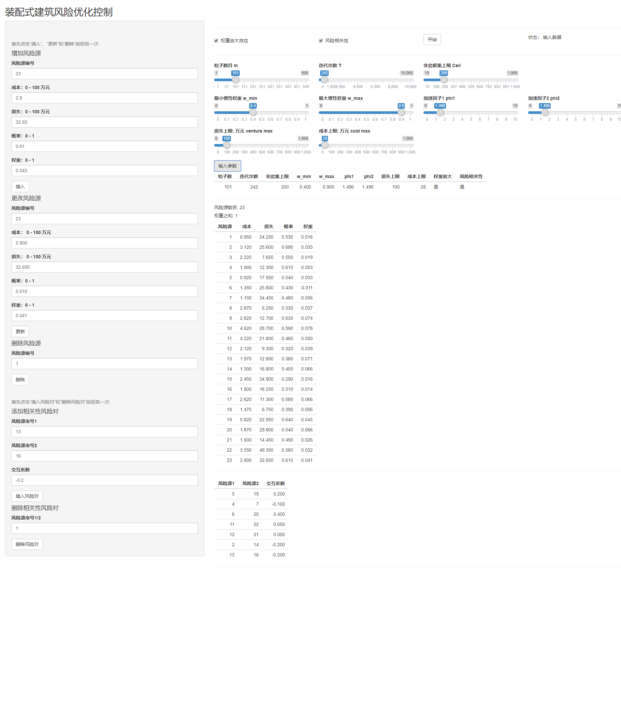

# Discrete MOPSO
discrete multiple objections particle swarm optimization algorithm in construction safety control

* refer to article [Multiobjective Optimization of Safety Risk of Prefabricated 

* [DMPSO_Model_function.R](https://github.com/AiDatawxy/DiscreteMOPSO/blob/master/DMPSO_Model_function.R) defines functions for MOPSO algorithm

* [DMPSO_Model.R](https://github.com/AiDatawxy/DiscreteMOPSO/blob/master/DMPSO_Model.R) builds the model

* [PH_Model.R](https://github.com/AiDatawxy/DiscreteMOPSO/blob/master/PH_Model.R), [PH_Model_function.R](https://github.com/AiDatawxy/DiscreteMOPSO/blob/master/PH_Model_function.R), [PHshiny_v2_0_3.R](https://github.com/AiDatawxy/DiscreteMOPSO/blob/master/PHshiny_v2_0_3.R) for building a simple ui using shinny package in RStudio

